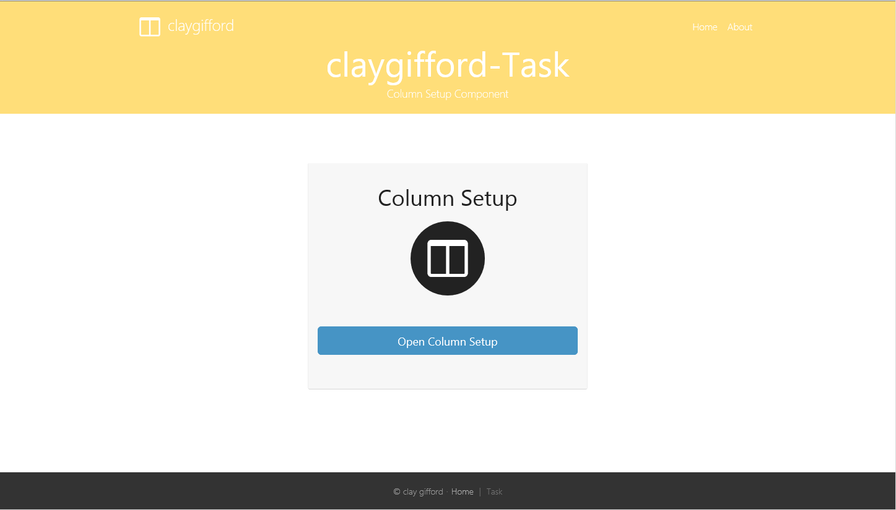
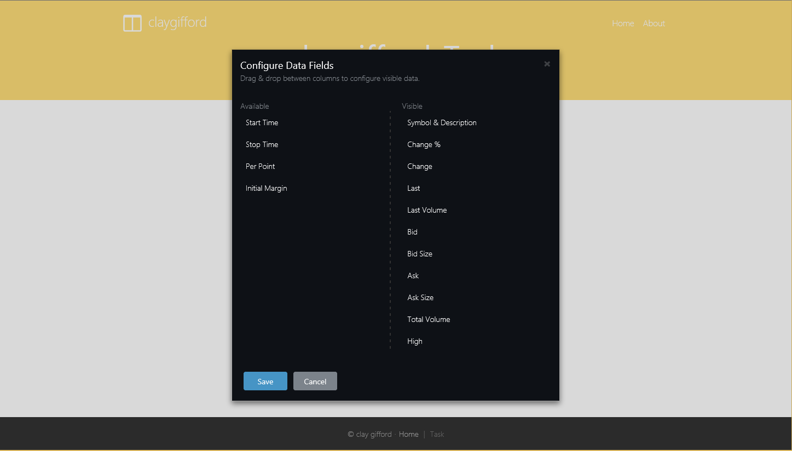

# claygifford-Task

> If you need help with this project, please reach to me by email.
> claygifford@gmail.com

### Screen shots





### Getting Started

Just [clone](github-windows://openRepo/https://github.com/claygifford/claygifford-task) or
[fork](https://github.com/claygifford/claygifford-task/fork) the repo:

```shell
$ git clone -o claygifford-Task -b master --single-branch 
      https://github.com/claygifford/claygifford-task.git
$ cd claygifford-Task
$ npm install -g gulp           # Install Gulp task runner globally
$ npm install                   # Install Node.js components listed in ./package.json
```

### How to Build

```shell
$ gulp build                    # or, `gulp build --release`
```

### How to Run

```shell
$ gulp                          # or, `gulp --release`
```

